# Online Donut Store: Inventory Microservice Extension
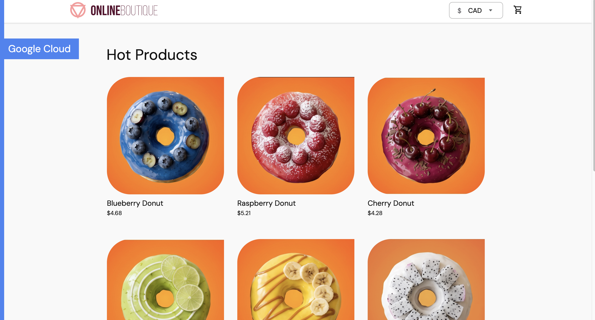

Extended [Google’s Online Boutique](https://github.com/GoogleCloudPlatform/microservices-demo) with a Java/Spring Boot inventory service integrated into the existing Go checkout service.

The extension uses Redis Lua scripting to check and deduct stock atomically, preventing concurrent requests from reducing stock below zero.

## Objectives

- Understand service boundaries and communication in an existing microservices application
- Implement an independent backend service and integrate it into the checkout flow
- Address race conditions in inventory updates
- Build and deploy the service using Docker, Kubernetes, and Skaffold

## My Contributions

| Component | Changes |
| --- | --- |
| Inventory service | Built REST endpoints for stock lookup and single-unit deduction using Java 21 and Spring Boot |
| Concurrency control | Implemented a Redis Lua script for atomic stock validation and deduction |
| Checkout integration | Added HTTP calls, timeouts, and inventory error handling to the Go checkout service |
| Containerization | Added a multi-stage Dockerfile for the inventory service |
| Deployment | Added Kubernetes Deployment and Service resources and registered the service in Skaffold and Kustomize |

The frontend, catalog, cart, payment, shipping, and other existing services come from the original application.

## Architecture & Checkout Flow

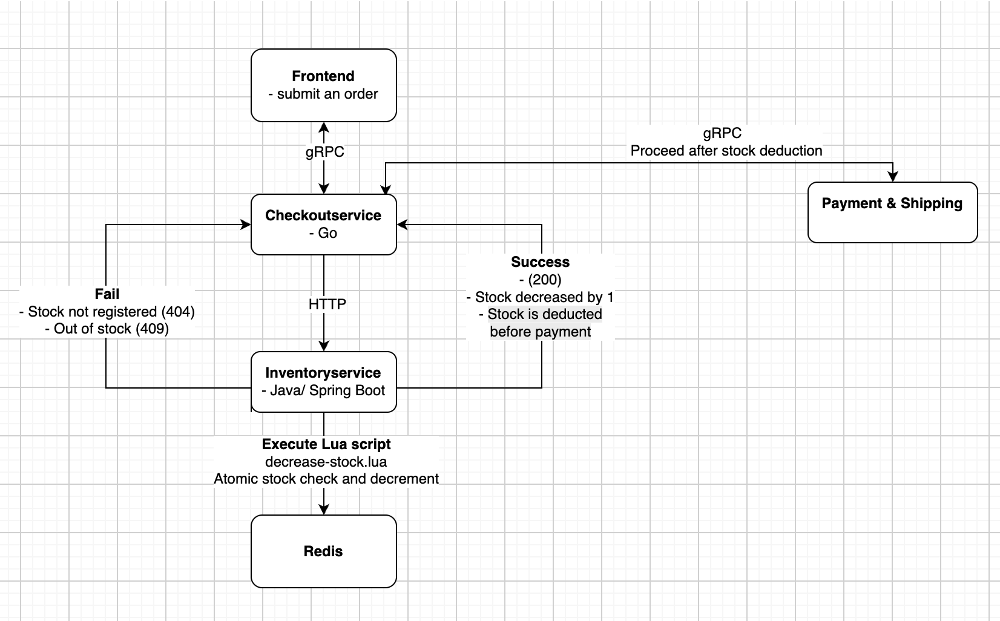


1. The frontend sends an order request to Checkout over gRPC.
2. Checkout reads the cart, validates that it contains one product with a quantity of one, and calculates the total.
3. Checkout requests stock deduction from Inventory Service over HTTP.
4. Inventory Service executes a Lua script in Redis to check and deduct one unit.
5. If deduction succeeds, Checkout proceeds with payment and shipping through the existing gRPC calls.
6. If the inventory request fails, Checkout returns an error without proceeding to payment.

* Inventory Service connects to the existing `redis-cart` instance and stores stock under `stock:{productId}` keys. 
* Checkout accesses the service at `http://inventoryservice:8080`.


## Inventory API

| Method | Endpoint | Success response |
| --- | --- | --- |
| GET | `/stock/{productId}` | HTTP 200 with the available stock |
| POST | `/stock/{productId}/decrease` | HTTP 200 with the remaining stock after deducting one unit |

* Both endpoints return **HTTP 404** if stock has not been registered. 
* The deduction endpoint returns **HTTP 409** if the product is out of stock.

* Stock is initialized directly in Redis:

```bash
# Initialize stock to 10 only if the key does not already exist
kubectl exec deployment/redis-cart -- redis-cli SET stock:red 10 NX

# Check the current stock
kubectl exec deployment/redis-cart -- redis-cli GET stock:red
```

## Preventing Race Conditions

With separate read and update operations, two concurrent requests could both see the last available unit and attempt to deduct it.

The `decrease-stock.lua` script executes the following steps atomically in Redis:

1. Verify that the stock key exists.
2. Check that stock is available.
3. Deduct one unit.
4. Return the remaining quantity.

Because other Redis operations cannot interleave with these steps, concurrent deduction requests cannot consume the same unit.

This protects the stock update itself; it does not make inventory deduction, payment, and shipping a single atomic transaction.

## Key Files

| File | Purpose |
| --- | --- |
| `src/inventoryservice/` | Spring Boot application, REST endpoints, Redis configuration, and Dockerfile |
| `src/inventoryservice/src/main/resources/lua/decrease-stock.lua` | Atomic stock validation and deduction |
| `src/checkoutservice/main.go` | Inventory HTTP client and checkout integration |
| `kubernetes-manifests/checkoutservice.yaml` | Inventory service URL configuration for Checkout |
| `kubernetes-manifests/inventoryservice.yaml` | Inventory Deployment, Service, and Redis connection settings |
| `kubernetes-manifests/kustomization.yaml` | Registration of the inventory manifest |
| `skaffold.yaml` | Inventory image build configuration |

## Development Environment 

- **Application:** Java 21, Spring Boot, Go, Redis, Lua
- **Build and deployment:** Docker, Kubernetes, Skaffold, Kustomize
- **Development platform:** Minikube in Google Cloud Shell

To build and deploy the application without the load generator, with one image build at a time:

```bash
skaffold run --module app --build-concurrency=1
```
## Demo

### Set up
Build and deploy the application in Google Cloud Shell.
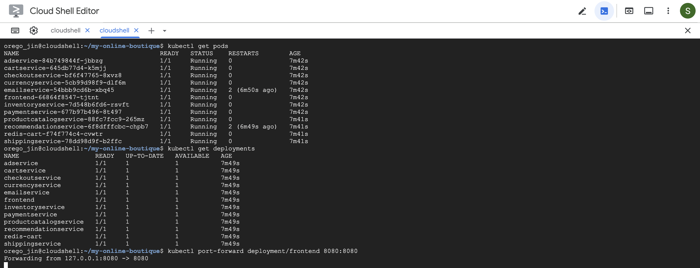

Initialize and verify stock in Redis.
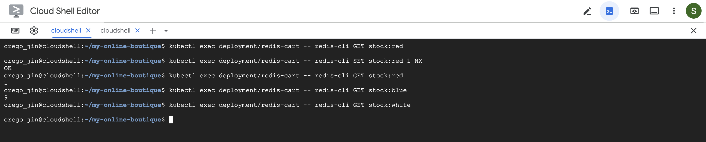

Open the front page.
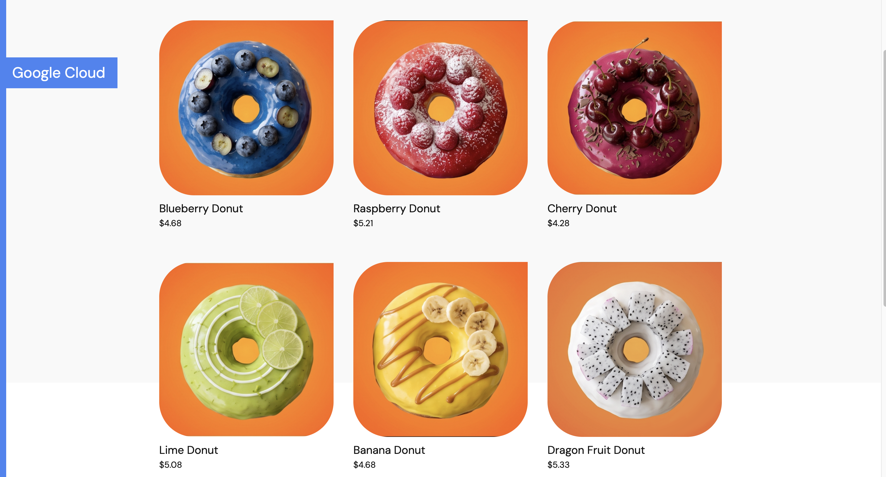

### Successful Order

Add one Blue Donut to the cart and proceed to checkout.
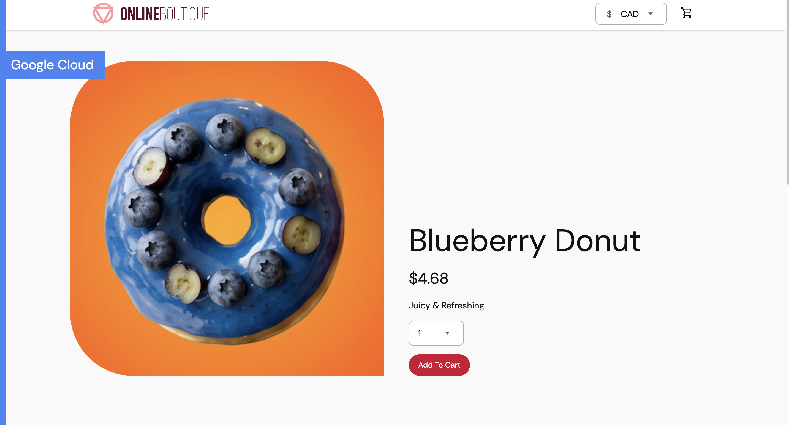

Submit the order and confirm that checkout succeeds.
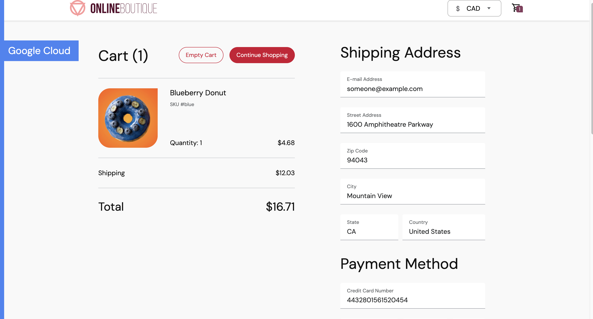

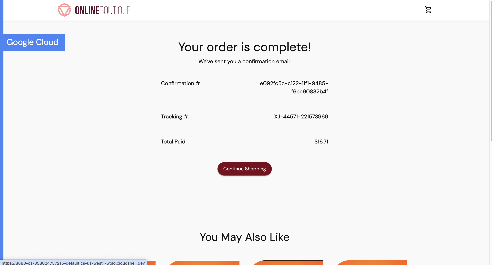

Verify that stock decreased by one in Redis.
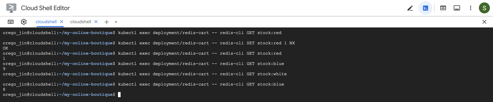

### Failed Orders

#### Unregistered Stock 
Attempt to order a product whose stock has not been initialized in Redis. (white)

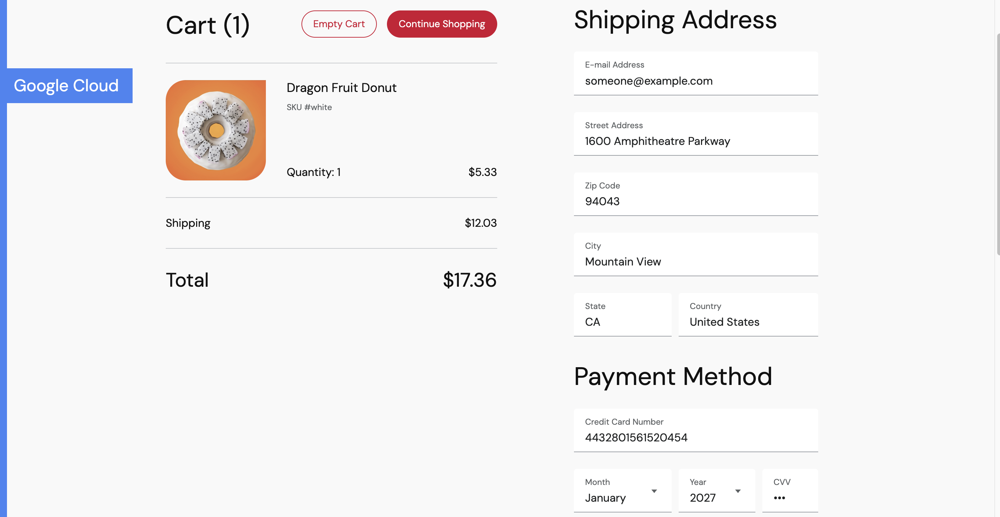
Checkout stops before payment and returns an error.

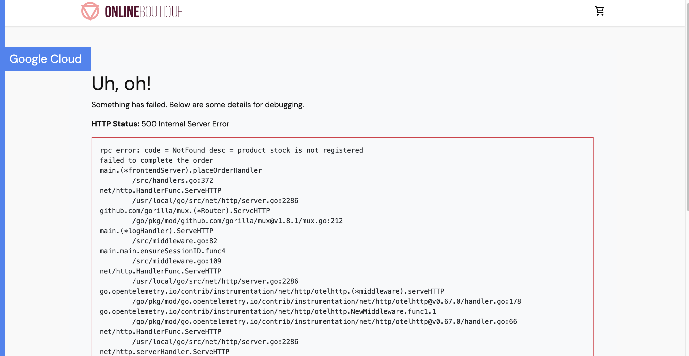

#### Out of Stock 
Purchase the last available Red Donut.
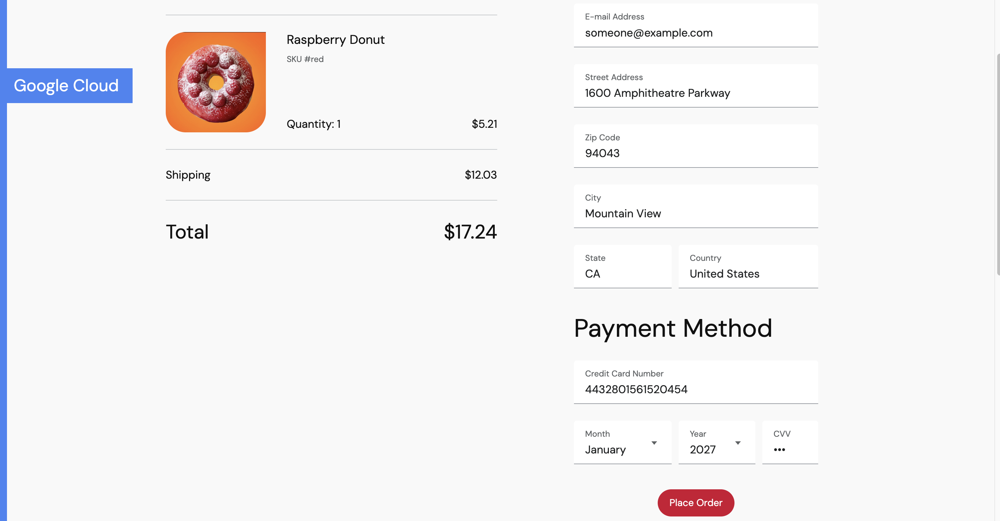

Verify that its stock is now zero.
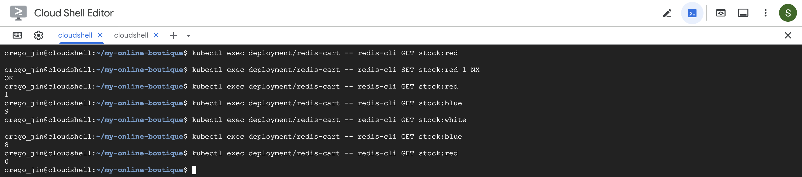

Attempt another purchase of the same product. Checkout is rejected because no stock remains.
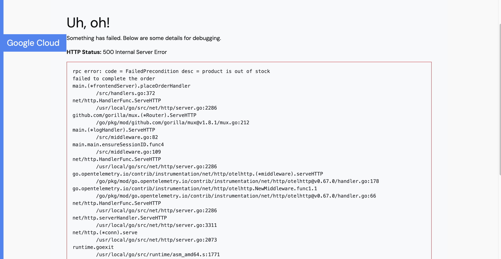

#### Unsupported Quantity

The current checkout implementation accepts only one product with a quantity of one.

Attempt to check out with a quantity of two.
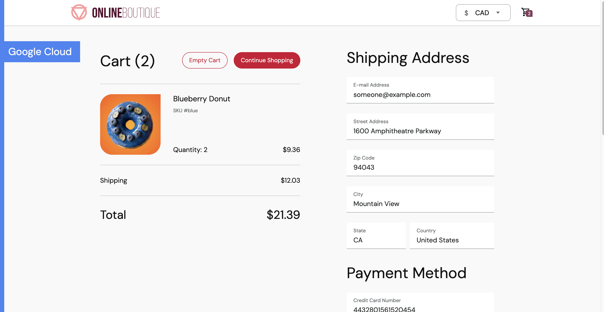

Checkout rejects the order before requesting stock deduction.
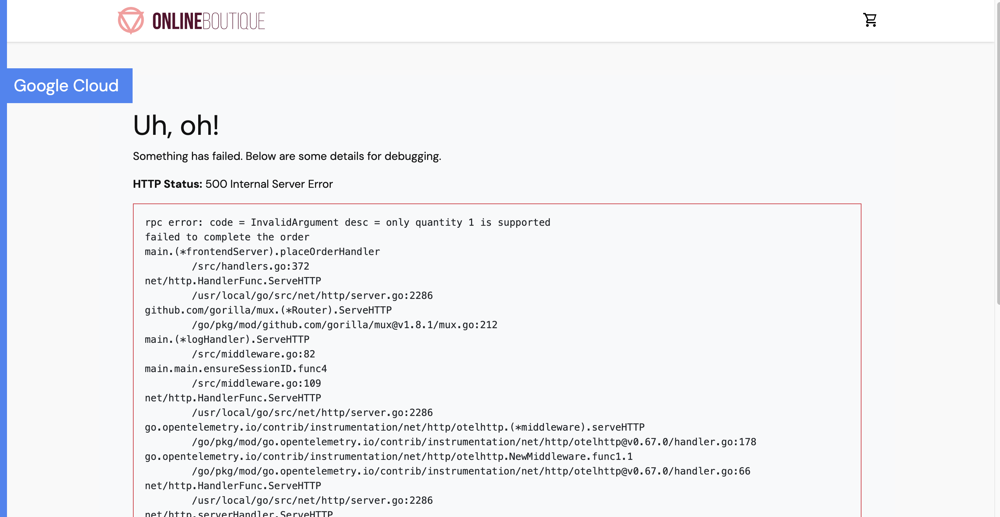


## Troubleshooting Experience

- Corrected the Maven source and resource directory layout to resolve packaging failures.
- Investigated disk-related Docker build failures and reclaimed unused build cache.
- Diagnosed Pending Pods by comparing CPU requests with node capacity.
- Adjusted the development rollout strategy to reduce overlap between old and new Pods.

## Scope and Limitations

- Checkout supports one product with a quantity of one per order.
- Multi-product atomic deduction is not supported.
- Requests are not idempotent. Retries may deduct stock more than once.
- Stock is deducted before payment and is not automatically restored if payment fails.
- Inventory data may be lost when the Redis Pod is replaced because the current deployment does not use persistent storage.

Potential improvements include request idempotency, stock recovery after failed checkout, and persistent Redis storage.